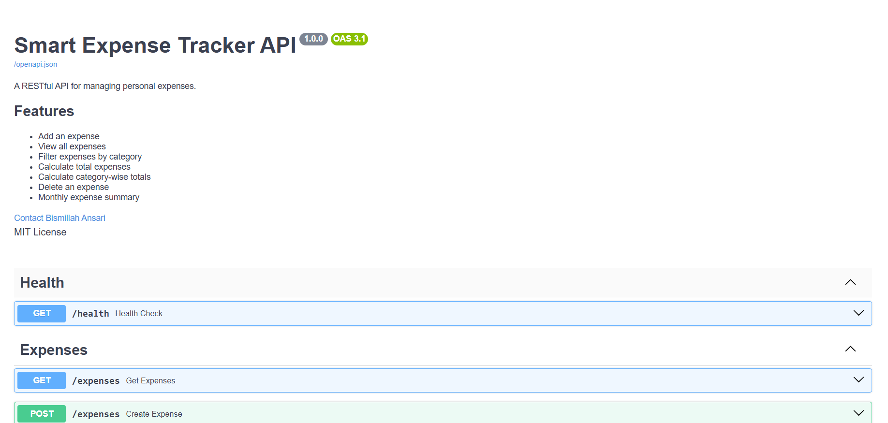
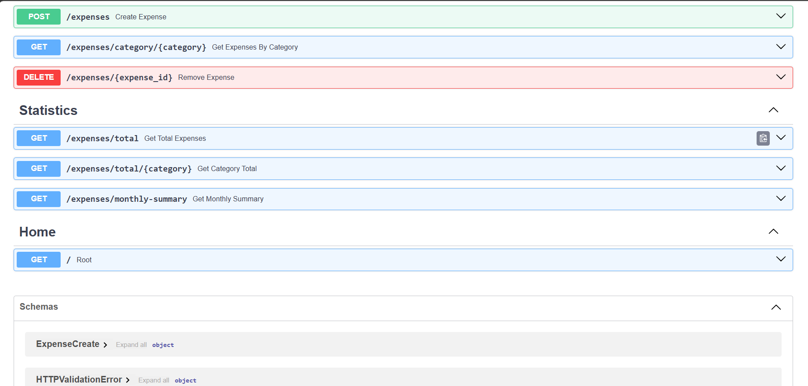
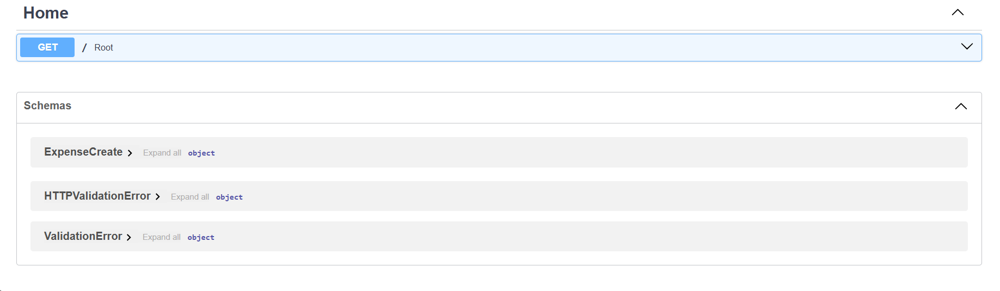
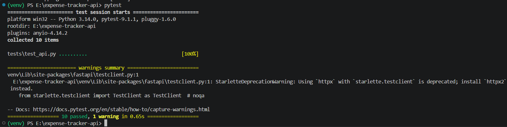

# Smart Expense Tracker API


## Overview

A RESTful API built using **FastAPI** to manage personal expenses. This project was developed as part of the **Diligent Software Engineering Apprenticeship 2026** take-home assignment.

---

## Features

## Features

- ✅ Create new expenses
- ✅ Retrieve all expenses
- ✅ Filter expenses by category
- ✅ Calculate total expenses
- ✅ Calculate category-wise totals
- ✅ Delete expenses
- ✅ Monthly expense summary
- ✅ Interactive Swagger documentation
- ✅ JSON-based local storage
- ✅ Automated API testing using Pytest

---

## API Highlights

- RESTful API built with FastAPI
- Automatic Swagger/OpenAPI documentation
- Input validation using Pydantic
- UUID-based expense identifiers
- Modular project architecture
- JSON file-based persistence
- Automated testing with Pytest

---

## Project Structure

```
expense-tracker-api/
│
├── README.md
├── AI_NOTES.md
├── requirements.txt
├── .gitignore
│
├── src/
│   ├── main.py
│   ├── routes.py
│   ├── storage.py
│   ├── models.py
│   ├── utils.py
│   └── expenses.json
│
└── tests/
    └── test_api.py
```

---

## Installation

Clone the repository

```bash
git clone <repository-url>
```

Move into the project directory

```bash
cd expense-tracker-api
```

Create a virtual environment

```bash
python -m venv venv
```

Activate the virtual environment

### Windows

```bash
venv\Scripts\activate
```

### Linux / macOS

```bash
source venv/bin/activate
```

Install dependencies

```bash
pip install -r requirements.txt
```

---

## Run the Server

```bash
uvicorn src.main:app --reload
```

Server:

```
http://127.0.0.1:8000
```

Swagger Documentation:

```
http://127.0.0.1:8000/docs
```
OpenAPI documentation is automatically generated by FastAPI and is available at:

```
http://127.0.0.1:8000/docs
```


## Screenshots

### Swagger UI





### Automated Tests



---

## Run Tests

```bash
pytest
```

Current Status:

```
10 tests passed
```

---

## API Endpoints

| Method | Endpoint | Description |
|--------|----------|-------------|
| GET | / | Home |
| GET | /health | Health Check |
| POST | /expenses | Add Expense |
| GET | /expenses | View All Expenses |
| GET | /expenses/category/{category} | Filter by Category |
| GET | /expenses/total | Total Expenses |
| GET | /expenses/total/{category} | Total by Category |
| GET | /expenses/monthly-summary | Monthly Summary |
| DELETE | /expenses/{expense_id} | Delete Expense |

---

## Tech Stack

## Technologies Used

| Technology | Purpose |
|------------|---------|
| Python 3.14 | Programming Language |
| FastAPI | REST API Framework |
| Pydantic | Data Validation |
| Uvicorn | ASGI Server |
| Pytest | Automated Testing |
| JSON | Local Data Storage |
| Git & GitHub | Version Control |

---

## Design Decisions

- Modular project structure with separate routing, models, utilities, and storage layers.
- Local JSON file storage was chosen as per assignment requirements.
- Consistent API response format using success, message, and data fields.
- Added automated tests to validate API functionality.

---

## Future Improvements

- SQLite/PostgreSQL integration
- User authentication
- Pagination
- Search functionality
- Docker support
- Expense analytics dashboard

---

## Author

**Bismillah Ansari**